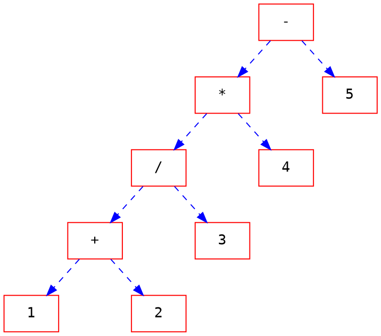

# 第十二章抽象資料型態

---
## stack堆疊

### 簡介
- 先進後出，後進先出
 

### 運算
- 創建空的stack 
```=
stack(stack_name)
```
- 增加一個data
```=
push(stack_name,data)
```
- 取出一個data
```=
pop(stack_name,data)
```
- 查看是否為空的stack
```=
empty(stack_name)
```
### 應用

- 四大分類
	- 反轉資料
		- 反轉資料需要將已知的一組資料重新排列，使得第一元素和最後元素互換，且所有介於第一和最後元素之間的位置也一樣互換。
		- 所以就是先把他push進去，再把它pop出來，根據stack先進後出的特性，所以他pop出來的便與他存進來的順序相反。
	- 配對資料
		- 我們常常需要在一個運算式中配對某些字元。利用一個堆疊來檢查所有開始的括號有跟一個結束的括號來配對。
		- 可以用來檢查括號是否有對稱
			- 當讀到左括號=push進去，右括號=pop出來
			- 當多或少時，都可以利用stack檢查出來
	- 延遲資料使用
	- 回溯步驟


在堆疊的應用實作上，我們可以用陣列跟鏈結來模擬。
- 陣列：
	- 首先每一元素需要兩個格子來進行存放，一個當作計數器，一個用來存放資料，一樣採取從最後面放入的優先出去
- 鏈結
	- 一個接著一個串再一起，然後一樣採取先進後出來讀取資料，而他也擁有計數器，用來計算當前位置與長度

---
## 佇列queue

### 簡介
- 先進先出
- 他屬於線性串列
- 新的資料一定是排在最後面，不能插隊
- 任何動作都是從第一個開始


### 運算
- 建立空佇列
```=
queue(queueName)
```
- 存入佇列
```=
enqueue(queueName, dataItem)
```


- 刪除佇列
```=
dequeue(queueName, dataItem)
```

- 清空佇列
```=
empty(queueName)
```

### 應用
每個作業系統、網路與無數其他領域中都會用到佇列


- 陣列：
	- 第一個陣列是前端，最後一筆資料是後端，他需要三個格子，分別是計數器、前端、後端

- 鏈結
	- 一樣採取先進先出，每一個存取資料的位置分成計數、前端與後端，每一次存取資料都從前方開始讀取

## 樹tree

- 結構
	- node節點
		- 有限集合的元素
	- arcs弧線
		- 有限集合的方向線
	- root根
		- 節點之一沒有向內弧線
	- path路徑
		- 根延著單一路徑
	

### 二元樹

#### 簡介
- 一個節點不能超過兩個分支
- 二元樹不是空的，就是由一個擁有兩個子樹的節點（也就是根）所組成，而每一個子樹也是個二元樹。


#### 運算
- 二元樹之運算
	- 建立
	- 插入
	- 刪除
	- 檢索
	- 清空
	- 拜訪(深度優先走訪)
		- 前序走訪
			- 根->左樹->右樹
		- 中序走訪
			- 左樹->根->右樹
		- 後序走訪
			- 左樹->右樹->根
	


- 前序走訪
	- F->B->A->D->C->E->G->I->H
- 中序走訪
	- A->B->C->D->E->F->G->H->I
- 後序走訪
	- A->C->E->D->B->H->I->G->F

#### 應用
- 霍夫曼編碼
- 運算式樹
	- 把式子變成二元樹。


- 前序走訪
	- -→*→/→+→1→2→3→4→5
- 中序走訪
	- 1→+→2→/→3→*→4→-→5
- 後序走訪
	- 1→2→+→3→/→4→*→5→-

在程式表示中，可以用兩個指標變數來儲存，第一個接第一個node，後一個接另外一個node
```cpp=
struct node
{
	struct node *lptr;
	struct node *rptr;
}
```
question 如果是用linllist的話，他只有一個指標位置，如果要用linkedlist那就需要把她的兩個街再一起，這樣要如何使它裡面的值相同。

- 二元搜尋樹
	- 他是用在搜尋資料
	- 小的數值放在左邊，大的放在右邊

